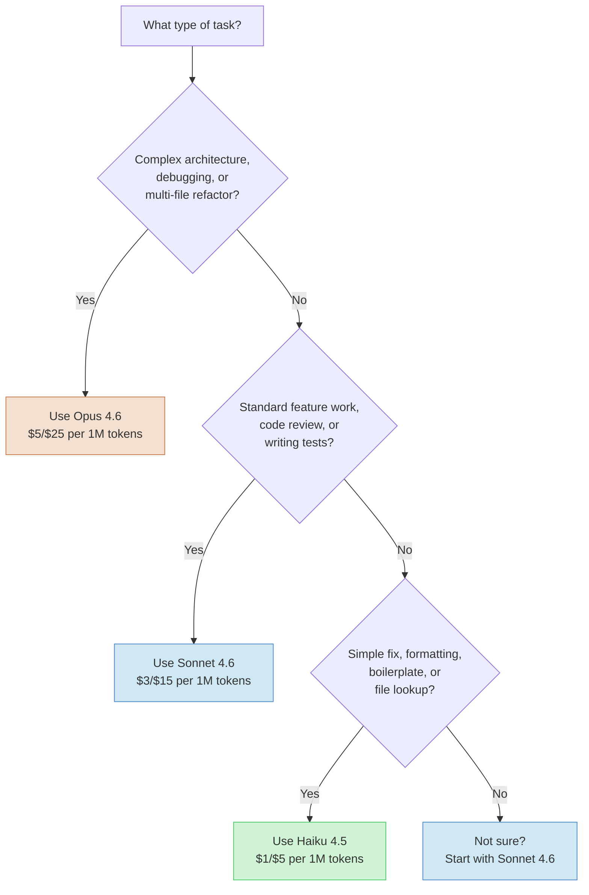
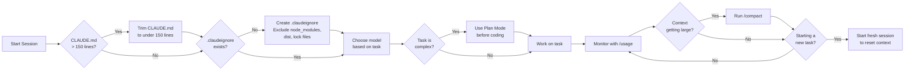
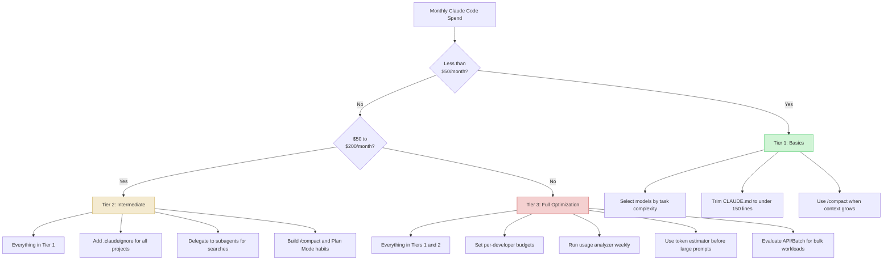

# Visual Optimization Diagrams

Mermaid flowcharts for key cost optimization decisions. These render natively on GitHub.

---

## Table of Contents

- [Model Selection Decision Tree](#model-selection-decision-tree)
- [Session Cost Optimization Flowchart](#session-cost-optimization-flowchart)
- [Cost Tier Strategy Map](#cost-tier-strategy-map)

---

## Model Selection Decision Tree

Use this to pick the right model before starting a task. Starting with Sonnet is always a safe default.

### Quick Reference

| Complexity | Model | Cost (Input/Output per 1M) | Examples |
|------------|-------|:--------------------------:|----------|
| High | Opus 4.6 | $5 / $25 | Architecture design, complex debugging, large refactors |
| Medium | Sonnet 4.6 | $3 / $15 | Feature implementation, code review, test writing |
| Low | Haiku 4.5 | $1 / $5 | Formatting, renaming, boilerplate, lookups |

---

## Session Cost Optimization Flowchart

Follow this checklist at the start of every Claude Code session to minimize waste.

### Key Checkpoints

1. **CLAUDE.md size** -- Every line loads on every turn. Keep it under 150 lines to avoid recurring token waste.
2. **.claudeignore** -- Prevents Claude from reading large generated or vendored files.
3. **Model selection** -- Match model to task complexity (see decision tree above).
4. **Plan Mode** -- For complex tasks, plan first to avoid expensive iterative dead ends.
5. **/compact** -- Summarizes conversation history to reduce context size mid-session.
6. **Fresh sessions** -- New tasks should get new sessions. Stale context from prior tasks is pure waste.

---

## Cost Tier Strategy Map

Which strategies matter most depends on your monthly spend. Focus on high-impact changes first.

### Strategy Summary by Tier

| Tier | Monthly Spend | Focus Areas | Expected Savings |
|------|:------------:|-------------|:----------------:|
| 1 - Basics | < $50 | Model selection, CLAUDE.md trimming, /compact | 15-30% |
| 2 - Intermediate | $50-200 | Add .claudeignore, subagents, Plan Mode habits | 30-45% |
| 3 - Full Optimization | > $200 | Team budgets, usage analyzer, token estimator, Batch API | 40-60% |

---

## Related Guides

- [Model Selection](03-model-selection.md) -- Detailed model comparison with cost-per-task data
- [Context Optimization](02-context-optimization.md) -- CLAUDE.md trimming and .claudeignore setup
- [Workflow Patterns](04-workflow-patterns.md) -- Plan Mode, subagents, and /compact usage
- [Team Budgeting](05-team-budgeting.md) -- Per-developer budgets and ROI tracking
