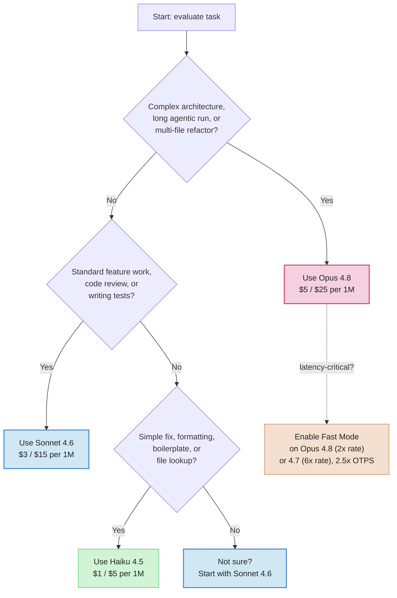
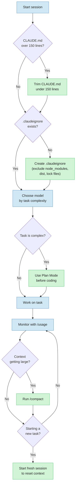
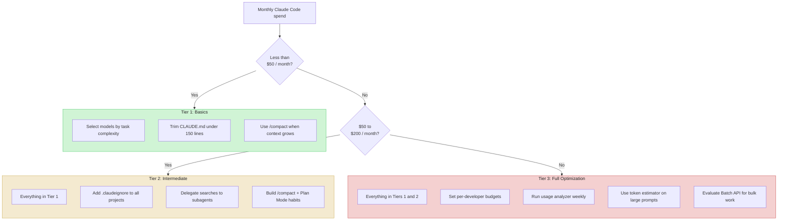
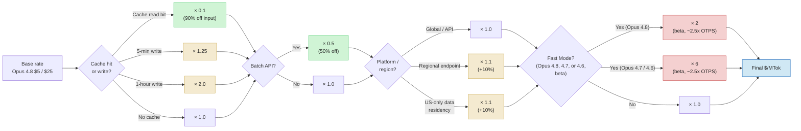

# Visual Optimization Diagrams

Mermaid flowcharts for key cost optimization decisions. These render natively on GitHub.

---

## Table of Contents

- [Claude Model Family (June 2026)](#claude-model-family-june-2026)
- [Model Selection Decision Tree](#model-selection-decision-tree)
- [Session Cost Optimization Flowchart](#session-cost-optimization-flowchart)
- [Cost Tier Strategy Map](#cost-tier-strategy-map)
- [Pricing Modifier Stack](#pricing-modifier-stack)

---

## Claude Model Family (June 2026)

The current Claude model lineup, their positioning, and cost tiers. Mythos 5 is the limited-availability sibling of Fable 5 under [Project Glasswing](https://anthropic.com/glasswing) — same specs and price, no safety classifiers.

```mermaid
flowchart TB
    subgraph GA["Generally Available"]
        direction TB
        fable5["Fable 5 (most capable)<br/>$10 / $50 per 1M<br/>1M context · 128K output<br/>Always-on adaptive thinking · No Fast Mode"]
        opus8["Opus 4.8 (Opus flagship)<br/>$5 / $25 per 1M<br/>1M context · 128K output<br/>Adaptive thinking · Fast Mode (beta)"]
        opus7["Opus 4.7<br/>$5 / $25 per 1M<br/>1M context · 128K output<br/>Adaptive thinking · Fast Mode (beta)"]
        opus6["Opus 4.6<br/>$5 / $25 per 1M<br/>1M context · 128K output<br/>Extended + adaptive · Fast Mode (beta)"]
        opus45["Opus 4.5<br/>$5 / $25 per 1M<br/>200K context · 64K output<br/>Extended thinking"]
        sonnet["Sonnet 4.6 (safe default)<br/>$3 / $15 per 1M<br/>1M context · 64K output<br/>Extended + adaptive thinking"]
        sonnet45["Sonnet 4.5<br/>$3 / $15 per 1M<br/>200K context · 64K output<br/>Extended thinking"]
        haiku["Haiku 4.5 (budget)<br/>$1 / $5 per 1M<br/>200K context · 64K output<br/>Extended thinking"]
    end

    subgraph RP["Limited Availability (Project Glasswing)"]
        direction TB
        mythos5["Mythos 5<br/>$10 / $50 per 1M<br/>Fable 5 without safety classifiers<br/>Approved Glasswing customers only"]
        mythos["Mythos Preview<br/>$25 / $125 per 1M<br/>Retires 2026-06-30<br/>Migrate to Mythos 5"]
    end

    classDef flagship fill:#f4d0e0,stroke:#c94a7a,stroke-width:2px,color:#222
    classDef snapshot fill:#f4e0d0,stroke:#c97a4a,color:#222
    classDef default fill:#d0e8f4,stroke:#4a8ac9,stroke-width:2px,color:#222
    classDef budget fill:#d0f4d5,stroke:#4ac96a,color:#222
    classDef preview fill:#e8d0f4,stroke:#7a4ac9,color:#222

    class fable5,opus8 flagship
    class opus7,opus6,opus45,sonnet45 snapshot
    class sonnet default
    class haiku budget
    class mythos5,mythos preview
```

### Model Positioning

| Model | Access | Best For | Why Not |
|-------|--------|----------|---------|
| Fable 5 | **GA on every platform** (Anthropic API, Claude Platform on AWS, Bedrock, Vertex AI, Microsoft Foundry) | The hardest reasoning and longest agentic runs; Mythos-class capability | 2x Opus pricing; always-on thinking; safety classifiers can refuse; no Fast Mode |
| Opus 4.8 | **GA on every platform** (Anthropic API, Claude Platform on AWS, Bedrock, Vertex AI) | Complex agentic coding, multi-file refactors, long autonomous runs | Overkill for simple edits; new tokenizer uses ~20-35% more tokens |
| Opus 4.7 | GA (previous flagship) | Pinned snapshots tuned to 4.7; stable | Choose 4.8 for the coding-quality step change unless you have a reason |
| Opus 4.6 | GA | Workloads tuned to the older tokenizer; stable snapshot | Choose 4.8 for coding-quality step change unless you have a reason |
| Opus 4.5 | GA | Pinned snapshots only | 200K context (not 1M); no Fast Mode; migrate up if you can |
| Sonnet 4.6 | GA | Everyday development (the safe default) | Stretched on complex architecture + long agentic runs |
| Sonnet 4.5 | GA | Pinned snapshots only | 200K context (not 1M); migrate to 4.6 if you need long context |
| Haiku 4.5 | GA | Formatting, renaming, simple edits, file lookups | Lacks reasoning depth for multi-file work; 200K context |
| Mythos 5 | Glasswing only | Fable 5's capabilities without safety classifiers (approved customers) | No self-serve access; use Fable 5 instead |
| Mythos Preview | Retires 2026-06-30 | (superseded by Mythos 5) | 5x output pricing; migrate before retirement |

---

## Model Selection Decision Tree

Use this to pick the right model before starting a task. Starting with Sonnet is always a safe default.

### Quick Reference

| Complexity | Model | Cost (Input/Output per 1M) | Examples |
|------------|-------|:--------------------------:|----------|
| Maximum | Fable 5 | $10 / $50 | Hardest reasoning, longest autonomous agentic runs, Mythos-class workloads |
| High | Opus 4.8 | $5 / $25 | Architecture design, complex debugging, large refactors, long agentic runs |
| High (Fast Mode) | Opus 4.8 | $10 / $50 | Latency-critical urgent work (2x premium, 2.5x output tokens/sec) |
| High (Fast Mode) | Opus 4.7 / 4.6 | $30 / $150 | Latency-critical urgent work (6x premium, 2.5x output tokens/sec) |
| Medium | Sonnet 4.6 | $3 / $15 | Feature implementation, code review, test writing |
| Low | Haiku 4.5 | $1 / $5 | Formatting, renaming, boilerplate, lookups |

---

## Session Cost Optimization Flowchart

Follow this checklist at the start of every Claude Code session to minimize waste.

### Key Checkpoints

1. **CLAUDE.md size** -- Every line loads on every turn. Keep it under 150 lines to avoid recurring token waste.
2. **.claudeignore** -- Prevents Claude from reading large generated or vendored files.
3. **Model selection** -- Match model to task complexity (see decision tree above).
4. **Plan Mode** -- For complex tasks, plan first to avoid expensive iterative dead ends.
5. **/compact** -- Summarizes conversation history to reduce context size mid-session.
6. **Fresh sessions** -- New tasks should get new sessions. Stale context from prior tasks is pure waste.

---

## Cost Tier Strategy Map

Which strategies matter most depends on your monthly spend. Focus on high-impact changes first.

### Strategy Summary by Tier

| Tier | Monthly Spend | Focus Areas | Expected Savings |
|------|:------------:|-------------|:----------------:|
| 1 - Basics | < $50 | Model selection, CLAUDE.md trimming, /compact | 15-30% |
| 2 - Intermediate | $50-200 | Add .claudeignore, subagents, Plan Mode habits | 30-45% |
| 3 - Full Optimization | > $200 | Team budgets, usage analyzer, token estimator, Batch API | 40-60% |

---

## Pricing Modifier Stack

How the various multipliers combine on top of the base $/MTok rate. Each modifier stacks multiplicatively.

### Stacking Examples (Opus 4.8 input at $5/MTok base)

| Scenario | Calculation | Effective rate |
|----------|-------------|---------------:|
| Standard API call | $5 × 1 | $5.00 |
| Cache read hit | $5 × 0.1 | $0.50 |
| Batch API | $5 × 0.5 | $2.50 |
| Batch + cache read | $5 × 0.5 × 0.1 | $0.25 |
| Regional endpoint on Bedrock | $5 × 1.1 | $5.50 |
| Regional + data residency | $5 × 1.1 × 1.1 | $6.05 |
| Fast Mode (Opus 4.8, beta) | $5 × 2 | $10.00 |
| Fast Mode (Opus 4.7 or 4.6, beta) | $5 × 6 | $30.00 |
| Fast Mode + cache read (Opus 4.8) | $5 × 2 × 0.1 | $1.00 |
| Fast Mode + 5m cache write (Opus 4.8) | $5 × 2 × 1.25 | $12.50 |
| Fast Mode + 1h cache write (Opus 4.8) | $5 × 2 × 2 | $20.00 |
| Fast Mode + data residency (Opus 4.8) | $5 × 2 × 1.1 | $11.00 |

> **Notes**:
> - Fast Mode **cannot** combine with Batch API or Priority Tier.
> - Switching between Fast and Standard speeds invalidates the prompt cache (different speed prefixes don't share cache).
> - Cache-write/hit multipliers DO stack on top of Fast Mode rates.
> - Data residency (`inference_geo: "us"`) only applies to Opus 4.6, Sonnet 4.6, and later models on Anthropic API and Claude Platform on AWS. Earlier models error if the parameter is set.

---

## Related Guides

- [Model Selection](03-model-selection.md) -- Detailed model comparison with cost-per-task data
- [Context Optimization](02-context-optimization.md) -- CLAUDE.md trimming and .claudeignore setup
- [Workflow Patterns](04-workflow-patterns.md) -- Plan Mode, subagents, and /compact usage
- [Team Budgeting](05-team-budgeting.md) -- Per-developer budgets and ROI tracking
- [Access Methods and Pricing](06-access-methods-pricing.md) -- Platform comparison, endpoint premiums, Fast Mode
- [Speed vs Cost](11-speed-vs-cost.md) -- Free latency levers first, Fast Mode economics last
