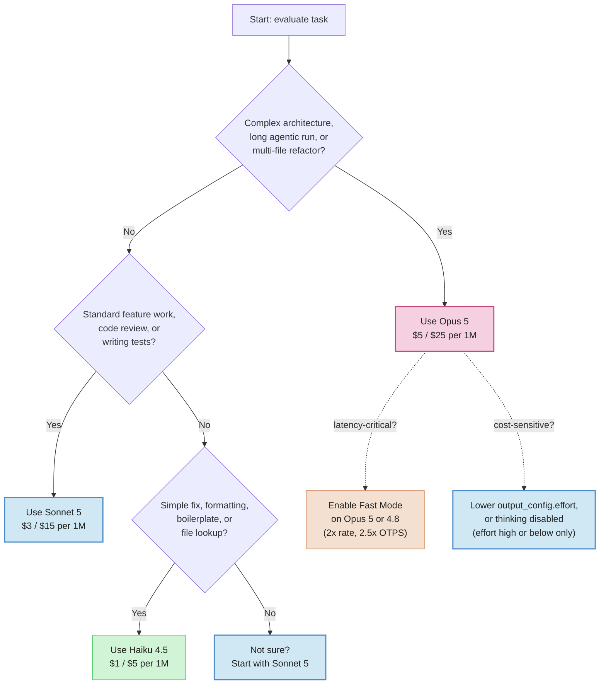
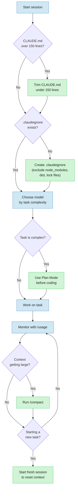
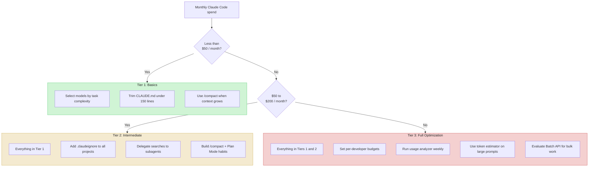
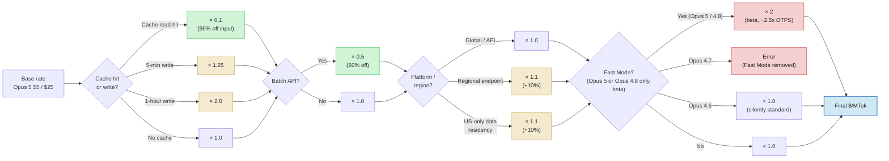

# Visual Optimization Diagrams

Mermaid flowcharts for key cost optimization decisions. These render natively on GitHub.

---

## Table of Contents

- [Claude Model Family (July 2026)](#claude-model-family-july-2026)
- [Model Selection Decision Tree](#model-selection-decision-tree)
- [Session Cost Optimization Flowchart](#session-cost-optimization-flowchart)
- [Cost Tier Strategy Map](#cost-tier-strategy-map)
- [Pricing Modifier Stack](#pricing-modifier-stack)

---

## Claude Model Family (July 2026)

The current Claude model lineup, their positioning, and cost tiers. Mythos 5 is the limited-availability sibling of Fable 5 under [Project Glasswing](https://anthropic.com/glasswing) -- same specs and price, no safety classifiers.

> **Updated 2026-07-25 for the Opus 5 launch.** Opus 5 (`claude-opus-5`, GA 2026-07-24) is the new Opus flagship at the same $5 / $25 as Opus 4.8, which moved into the Legacy accordion. Fast Mode narrowed to Opus 5 and Opus 4.8 only, both at a flat 2x. Mythos Preview retired on 2026-06-30.

```mermaid
flowchart TB
    subgraph GA["Generally Available"]
        direction TB
        fable5["Fable 5 (most capable)<br/>$10 / $50 per 1M<br/>1M context · 128K output<br/>Always-on adaptive thinking · No Fast Mode"]
        opus5["Opus 5 (Opus flagship)<br/>$5 / $25 per 1M<br/>1M context · 128K output<br/>Thinking ON by default · Fast Mode (beta)"]
        opus8["Opus 4.8 (legacy)<br/>$5 / $25 per 1M<br/>1M context · 128K output<br/>Adaptive thinking · Fast Mode (beta)"]
        opus7["Opus 4.7 (legacy)<br/>$5 / $25 per 1M<br/>1M context · 128K output<br/>Adaptive thinking · Fast Mode removed"]
        opus6["Opus 4.6 (legacy)<br/>$5 / $25 per 1M<br/>1M context · 128K output<br/>Extended + adaptive · Fast Mode removed"]
        opus45["Opus 4.5<br/>$5 / $25 per 1M<br/>200K context · 64K output<br/>Extended thinking"]
        sonnet5["Sonnet 5 (safe default)<br/>$3 / $15 per 1M<br/>$2 / $10 intro to 2026-08-31<br/>Extended + adaptive thinking"]
        sonnet["Sonnet 4.6<br/>$3 / $15 per 1M<br/>1M context · 64K output<br/>Extended + adaptive thinking"]
        sonnet45["Sonnet 4.5<br/>$3 / $15 per 1M<br/>200K context · 64K output<br/>Extended thinking"]
        haiku["Haiku 4.5 (budget)<br/>$1 / $5 per 1M<br/>200K context · 64K output<br/>Extended thinking"]
    end

    subgraph RP["Limited Availability (Project Glasswing)"]
        direction TB
        mythos5["Mythos 5<br/>$10 / $50 per 1M<br/>Fable 5 without safety classifiers<br/>Approved Glasswing customers only"]
        mythos["Mythos Preview<br/>Retired 2026-06-30<br/>Migrate to Mythos 5"]
    end

    classDef flagship fill:#f4d0e0,stroke:#c94a7a,stroke-width:2px,color:#222
    classDef snapshot fill:#f4e0d0,stroke:#c97a4a,color:#222
    classDef default fill:#d0e8f4,stroke:#4a8ac9,stroke-width:2px,color:#222
    classDef budget fill:#d0f4d5,stroke:#4ac96a,color:#222
    classDef preview fill:#e8d0f4,stroke:#7a4ac9,color:#222

    class fable5,opus5 flagship
    class opus8,opus7,opus6,opus45,sonnet,sonnet45 snapshot
    class sonnet5 default
    class haiku budget
    class mythos5,mythos preview
```

### Model Positioning

| Model | Access | Best For | Why Not |
|-------|--------|----------|---------|
| Fable 5 | **GA on every platform** (Anthropic API, Claude Platform on AWS, Bedrock, Vertex AI, Microsoft Foundry) | The hardest reasoning and longest agentic runs; Mythos-class capability | 2x Opus 5 pricing; always-on thinking; safety classifiers can refuse; no Fast Mode |
| Opus 5 | **GA on every platform** (Anthropic API, Claude Platform on AWS, Bedrock, Vertex AI) | Complex agentic coding, multi-file refactors, long autonomous runs; the current "start here" Opus | Thinking is ON by default and bills as output, so the effective cost is higher than 4.8 at the same posted rate |
| Opus 4.8 | GA (legacy) | Prompts already tuned to this snapshot; the fallback target for Opus 5 cyber refusals | No cost argument to stay; retires no sooner than 2027-05-28 |
| Opus 4.7 | GA (legacy) | Pinned snapshots tuned to 4.7 | Fast Mode was removed: `speed: "fast"` now returns an error |
| Opus 4.6 | GA (legacy) | Workloads tuned to the older tokenizer; stable snapshot | Fast Mode was removed *silently*: the request succeeds at standard speed and standard rates |
| Opus 4.5 | GA | Pinned snapshots only | 200K context (not 1M); no Fast Mode; retires 2026-11-24 |
| Sonnet 5 | GA | Everyday development (the safe default) | Stretched on complex architecture + long agentic runs |
| Sonnet 4.6 | GA | Prompts tuned to this snapshot | Sonnet 5 is the current mid-tier; no cost difference at standard rates |
| Sonnet 4.5 | GA | Pinned snapshots only | 200K context (not 1M); retires 2026-09-29 |
| Haiku 4.5 | GA | Formatting, renaming, simple edits, file lookups | Lacks reasoning depth for multi-file work; 200K context; 4,096-token cache floor |
| Mythos 5 | Glasswing only | Fable 5's capabilities without safety classifiers (approved customers) | No self-serve access; use Fable 5 instead |
| Mythos Preview | **Retired 2026-06-30** | (superseded by Mythos 5) | No longer callable; migrate to Mythos 5 |

---

## Model Selection Decision Tree

Use this to pick the right model before starting a task. Starting with Sonnet is always a safe default.

```mermaid
flowchart TD
    A[Start: evaluate task] --> B{"Complex architecture,<br/>long agentic run, or<br/>multi-file refactor?"}
    B -- Yes --> C["Use Opus 5<br/>$5 / $25 per 1M"]
    B -- No --> D{"Standard feature work,<br/>code review, or<br/>writing tests?"}
    D -- Yes --> E["Use Sonnet 5<br/>$3 / $15 per 1M"]
    D -- No --> F{"Simple fix, formatting,<br/>boilerplate, or<br/>file lookup?"}
    F -- Yes --> G["Use Haiku 4.5<br/>$1 / $5 per 1M"]
    F -- No --> H["Not sure?<br/>Start with Sonnet 5"]

    C -. "latency-critical?" .-> C2["Enable Fast Mode<br/>on Opus 5 or 4.8<br/>(2x rate, 2.5x OTPS)"]
    C -. "cost-sensitive?" .-> C3["Lower output_config.effort,<br/>or thinking disabled<br/>(effort high or below only)"]

    classDef flagship fill:#f4d0e0,stroke:#c94a7a,stroke-width:2px,color:#222
    classDef fast fill:#f4e0d0,stroke:#c97a4a,color:#222
    classDef mid fill:#d0e8f4,stroke:#4a8ac9,stroke-width:2px,color:#222
    classDef low fill:#d0f4d5,stroke:#4ac96a,color:#222

    class C flagship
    class C2 fast
    class C3,E,H mid
    class G low
```

### Quick Reference

| Complexity | Model | Cost (Input/Output per 1M) | Examples |
|------------|-------|:--------------------------:|----------|
| Maximum | Fable 5 | $10 / $50 | Hardest reasoning, longest autonomous agentic runs, Mythos-class workloads |
| High | Opus 5 | $5 / $25 | Architecture design, complex debugging, large refactors, long agentic runs |
| High (Fast Mode) | Opus 5 or Opus 4.8 | $10 / $50 | Latency-critical urgent work (2x premium, 2.5x output tokens/sec) |
| High (legacy) | Opus 4.7 / 4.6 | $5 / $25 | Pinned snapshots only. Fast Mode is gone: 4.7 errors, 4.6 silently runs standard |
| Medium | Sonnet 5 | $3 / $15 | Feature implementation, code review, test writing ($2 / $10 intro through 2026-08-31) |
| Low | Haiku 4.5 | $1 / $5 | Formatting, renaming, boilerplate, lookups |

> **Opus 5 caveat.** The posted rate matches Opus 4.8, but thinking is ON by default and reasoning tokens bill as output. Expect the same task to cost more until you tune `output_config.effort` (defaults to `high`) or set `thinking: {type: "disabled"}`, which is only legal at effort `high` or below -- pairing it with `xhigh` or `max` returns a 400. `max_tokens` caps thinking plus text combined, so raise it before running at high effort.

---

## Session Cost Optimization Flowchart

Follow this checklist at the start of every Claude Code session to minimize waste.

```mermaid
flowchart TD
    A[Start session] --> B{"CLAUDE.md<br/>over 150 lines?"}
    B -- Yes --> C["Trim CLAUDE.md<br/>under 150 lines"]
    B -- No --> D
    C --> D{".claudeignore<br/>exists?"}
    D -- No --> E["Create .claudeignore<br/>(exclude node_modules,<br/>dist, lock files)"]
    D -- Yes --> F
    E --> F["Choose model<br/>by task complexity"]
    F --> G{"Task is complex?"}
    G -- Yes --> H["Use Plan Mode<br/>before coding"]
    G -- No --> I
    H --> I["Work on task"]
    I --> J["Monitor with /usage"]
    J --> K{"Context<br/>getting large?"}
    K -- Yes --> L["Run /compact"]
    K -- No --> M
    L --> M{"Starting a<br/>new task?"}
    M -- Yes --> N["Start fresh session<br/>to reset context"]
    M -- No --> J

    classDef action fill:#d0f4d5,stroke:#4ac96a,color:#222
    classDef warn fill:#f4ead0,stroke:#c9a84a,color:#222
    classDef check fill:#d0e8f4,stroke:#4a8ac9,color:#222

    class A,F,I,J check
    class C,E,H,L,N action
```

### Key Checkpoints

1. **CLAUDE.md size** -- Every line loads on every turn. Keep it under 150 lines to avoid recurring token waste.
2. **.claudeignore** -- Prevents Claude from reading large generated or vendored files.
3. **Model selection** -- Match model to task complexity (see decision tree above).
4. **Plan Mode** -- For complex tasks, plan first to avoid expensive iterative dead ends.
5. **/compact** -- Summarizes conversation history to reduce context size mid-session.
6. **Fresh sessions** -- New tasks should get new sessions. Stale context from prior tasks is pure waste.

---

## Cost Tier Strategy Map

Which strategies matter most depends on your monthly spend. Focus on high-impact changes first.

```mermaid
flowchart TD
    A[Monthly Claude Code spend] --> B{"Less than<br/>$50 / month?"}
    B -- Yes --> T1
    B -- No --> D{"$50 to<br/>$200 / month?"}
    D -- Yes --> T2
    D -- No --> T3

    subgraph T1["Tier 1: Basics"]
        direction TB
        C1["Select models by task complexity"]
        C2["Trim CLAUDE.md under 150 lines"]
        C3["Use /compact when context grows"]
    end

    subgraph T2["Tier 2: Intermediate"]
        direction TB
        E1["Everything in Tier 1"]
        E2["Add .claudeignore to all projects"]
        E3["Delegate searches to subagents"]
        E4["Build /compact + Plan Mode habits"]
    end

    subgraph T3["Tier 3: Full Optimization"]
        direction TB
        F1["Everything in Tiers 1 and 2"]
        F2["Set per-developer budgets"]
        F3["Run usage analyzer weekly"]
        F4["Use token estimator on large prompts"]
        F5["Evaluate Batch API for bulk work"]
    end

    classDef tier1 fill:#d0f4d5,stroke:#4ac96a,color:#222
    classDef tier2 fill:#f4ead0,stroke:#c9a84a,color:#222
    classDef tier3 fill:#f4d0d0,stroke:#c94a4a,color:#222

    class T1 tier1
    class T2 tier2
    class T3 tier3
```

### Strategy Summary by Tier

| Tier | Monthly Spend | Focus Areas | Expected Savings |
|------|:------------:|-------------|:----------------:|
| 1 - Basics | < $50 | Model selection, CLAUDE.md trimming, /compact | 15-30% |
| 2 - Intermediate | $50-200 | Add .claudeignore, subagents, Plan Mode habits | 30-45% |
| 3 - Full Optimization | > $200 | Team budgets, usage analyzer, token estimator, Batch API | 40-60% |

---

## Pricing Modifier Stack

How the various multipliers combine on top of the base $/MTok rate. Each modifier stacks multiplicatively.

```mermaid
flowchart LR
    base["Base rate<br/>Opus 5 $5 / $25"] --> cache{"Cache hit<br/>or write?"}

    cache -- "Cache read hit" --> cacheRead["× 0.1<br/>(90% off input)"]
    cache -- "5-min write" --> write5m["× 1.25"]
    cache -- "1-hour write" --> write1h["× 2.0"]
    cache -- "No cache" --> normal["× 1.0"]

    cacheRead --> batch{"Batch API?"}
    write5m --> batch
    write1h --> batch
    normal --> batch

    batch -- "Yes" --> batchYes["× 0.5<br/>(50% off)"]
    batch -- "No" --> batchNo["× 1.0"]

    batchYes --> region{"Platform /<br/>region?"}
    batchNo --> region

    region -- "Global / API" --> regGlobal["× 1.0"]
    region -- "Regional endpoint" --> regRegional["× 1.1<br/>(+10%)"]
    region -- "US-only data<br/>residency" --> regData["× 1.1<br/>(+10%)"]

    regGlobal --> fast{"Fast Mode?<br/>(Opus 5 or Opus 4.8 only,<br/>beta)"}
    regRegional --> fast
    regData --> fast

    fast -- "Yes (Opus 5 / 4.8)" --> fastYes["× 2<br/>(beta, ~2.5x OTPS)"]
    fast -- "Opus 4.7" --> fastErr["Error<br/>(Fast Mode removed)"]
    fast -- "Opus 4.6" --> fastSilent["× 1.0<br/>(silently standard)"]
    fast -- "No" --> fastNo["× 1.0"]

    fastYes --> final["Final $/MTok"]
    fastSilent --> final
    fastNo --> final

    classDef discount fill:#d0f4d5,stroke:#4ac96a,color:#222
    classDef premium fill:#f4ead0,stroke:#c9a84a,color:#222
    classDef expensive fill:#f4d0d0,stroke:#c94a4a,color:#222
    classDef result fill:#d0e8f4,stroke:#4a8ac9,stroke-width:2px,color:#222

    class cacheRead,batchYes discount
    class write5m,write1h,regRegional,regData premium
    class fastYes,fastErr expensive
    class final result
```

### Stacking Examples (Opus 5 input at $5/MTok base)

| Scenario | Calculation | Effective rate |
|----------|-------------|---------------:|
| Standard API call | $5 × 1 | $5.00 |
| Cache read hit | $5 × 0.1 | $0.50 |
| Batch API | $5 × 0.5 | $2.50 |
| Batch + cache read | $5 × 0.5 × 0.1 | $0.25 |
| Regional endpoint on Bedrock | $5 × 1.1 | $5.50 |
| Regional + data residency | $5 × 1.1 × 1.1 | $6.05 |
| Fast Mode (Opus 5 or 4.8, beta) | $5 × 2 | $10.00 |
| Fast Mode + cache read | $5 × 2 × 0.1 | $1.00 |
| Fast Mode + 5m cache write | $5 × 2 × 1.25 | $12.50 |
| Fast Mode + 1h cache write | $5 × 2 × 2 | $20.00 |
| Fast Mode + data residency | $5 × 2 × 1.1 | $11.00 |

> **Notes**:
> - Fast Mode is now a **flat 2x on Opus 5 and Opus 4.8 only**. The old 6x tier ($30 / $150 on Opus 4.7 and 4.6) no longer exists: `speed: "fast"` returns an error on Opus 4.7, and Opus 4.6 accepts it but silently runs at standard speed and standard rates. Check `usage.speed` in the response -- if it comes back `"standard"`, you did not get Fast Mode.
> - Fast Mode **cannot** combine with Batch API or Priority Tier.
> - Switching between Fast and Standard speeds invalidates the prompt cache (different speed prefixes don't share cache).
> - Cache-write/hit multipliers DO stack on top of Fast Mode rates.
> - Data residency (`inference_geo: "us"`) only applies to Opus 4.6, Sonnet 4.6, and all later models (Opus 5 included) on Anthropic API and Claude Platform on AWS. Earlier models error if the parameter is set.
> - **Not shown on the diagram:** extended thinking has no multiplier -- reasoning tokens simply bill as output at the normal rate. On Opus 5 thinking is on by default, so the same request produces more billable output tokens than it did on Opus 4.8 at the identical posted rate.

### Minimum Cacheable Prompt Length

A `cache_control` block below the model's floor is **silently ignored**. No error, no `cache_creation_input_tokens`, full input price on every turn.

| Model | Minimum cacheable prompt |
|-------|-------------------------:|
| Opus 5 | 512 tokens |
| Fable 5 / Mythos 5 | 512 tokens |
| Opus 4.8 | 1,024 tokens |
| Opus 4.7 | 2,048 tokens |
| Opus 4.6 / Opus 4.5 | 4,096 tokens |
| Opus 4.1 | 1,024 tokens |
| Sonnet 5 / 4.6 / 4.5 | 1,024 tokens |
| Haiku 4.5 | 4,096 tokens |
| Haiku 3.5 | 2,048 tokens |

Size your cached prefix against the **highest** floor you route to. A 2,000-token prefix caches on Opus 5 and Sonnet 5 but not on Haiku 4.5, so a Haiku-first routing tier can quietly pay full price while your Opus tier looks fine.

---

## Related Guides

- [Model Selection](03-model-selection.md) -- Detailed model comparison with cost-per-task data
- [Context Optimization](02-context-optimization.md) -- CLAUDE.md trimming and .claudeignore setup
- [Workflow Patterns](04-workflow-patterns.md) -- Plan Mode, subagents, and /compact usage
- [Team Budgeting](05-team-budgeting.md) -- Per-developer budgets and ROI tracking
- [Access Methods and Pricing](06-access-methods-pricing.md) -- Platform comparison, endpoint premiums, Fast Mode
- [Speed vs Cost](11-speed-vs-cost.md) -- Free latency levers first, Fast Mode economics last
